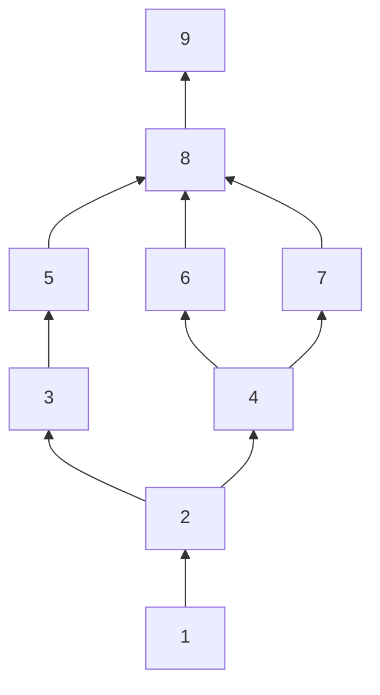

# Game Plan

[Repl.it Code](https://repl.it/@ConspiracyTheor/Computer-Science-Game "repl.it")  

[TOC]

## Instructions

- Create a game (could be text or graphics based) which has the following:
- A character which you are able to move between rooms
- This character has the following attributes:
	- Health
	- Speed
	- Attack
- A backpack which can store up to 3 items (there has to be a mechanism to check -  whether it is full before you pick another item up)
- These rooms are linked to each other
- These rooms can contain:
	- Enemies
	- Locked Doors which require a key
	- Items that can help the adventurer along their quest (improve their attributes/keys)
	- Have a clear end circumstance which results in win/lose

## Rooms



| Room Number | Basic Enemies | Normal Enemies | Hard Enemies |         Items          |
| :---------: | :-----------: | :------------: | :----------: | :--------------------: |
|      1      |       1       |                |              |          Key           |
|      2      |       3       |                |              | Apple, Upgrade Station |
|      3      |       1       |       1        |              |      Health Pack       |
|      4      |       1       |       1        |              |      Health Pack       |
|      5      |       1       |                |      1       |                        |
|      6      |       1       |                |      1       |                        |
|      7      |       1       |                |      1       |                        |
|      8      |       1       |                |      1       |                        |
|      9      |               |   Boss Fight   |              |                        |

## Item / Character Stats and Upgrades

- Apple - restores 15 health
- Key - unlocks doors
- Upgrade station - allows for the upgrade of any of the key attributes

## Enemy Classes

| Enemy Class | Health | Speed | Attack |
| :---------: | :----: | :---: | :----: |
|    Basic    |   15   |  35   |   5    |
|   Normal    |   25   |  50   |   10   |
|    Hard     |   35   |  65   |   15   |
|    Boss     |   75   |  100  |   25   |

## Program Flow

1. Enter room
2. Fight enemies
	1. INSERT MORE HERE
3. Pick up items in room
4. Use items
5. Pick and then move on to next room

## Expected Output

```

```